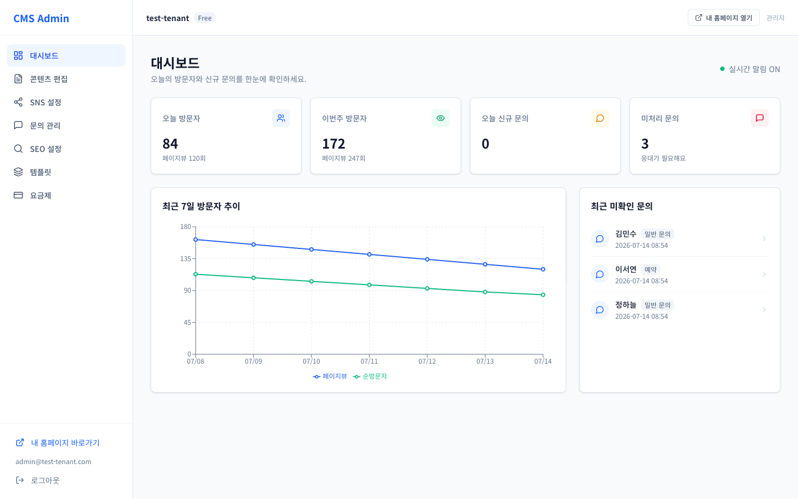
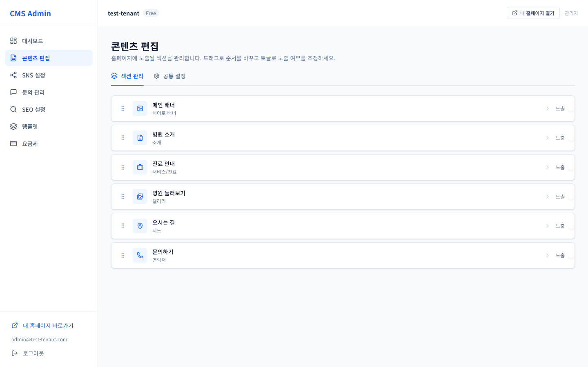
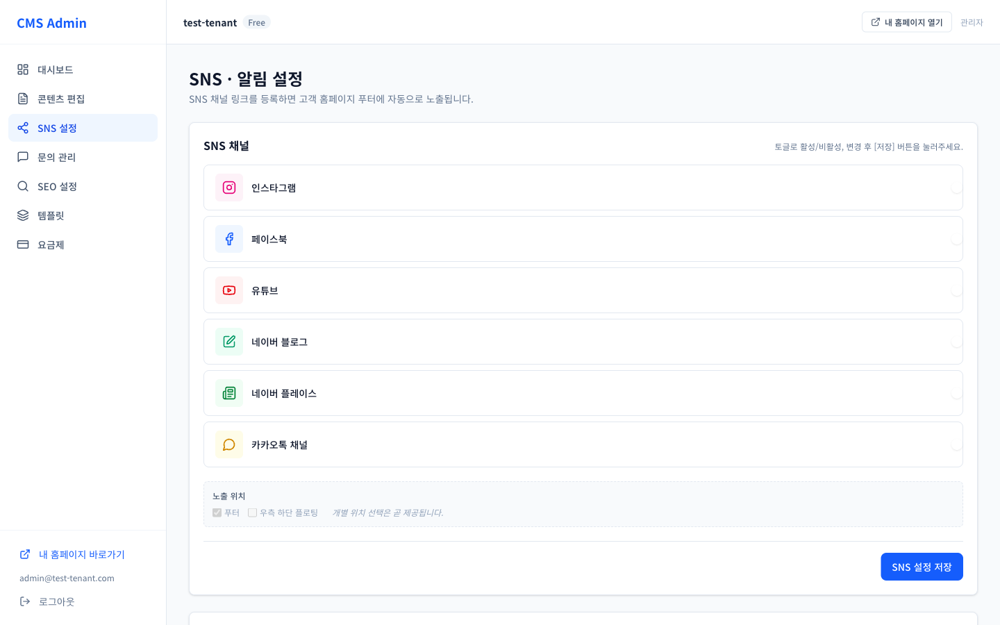
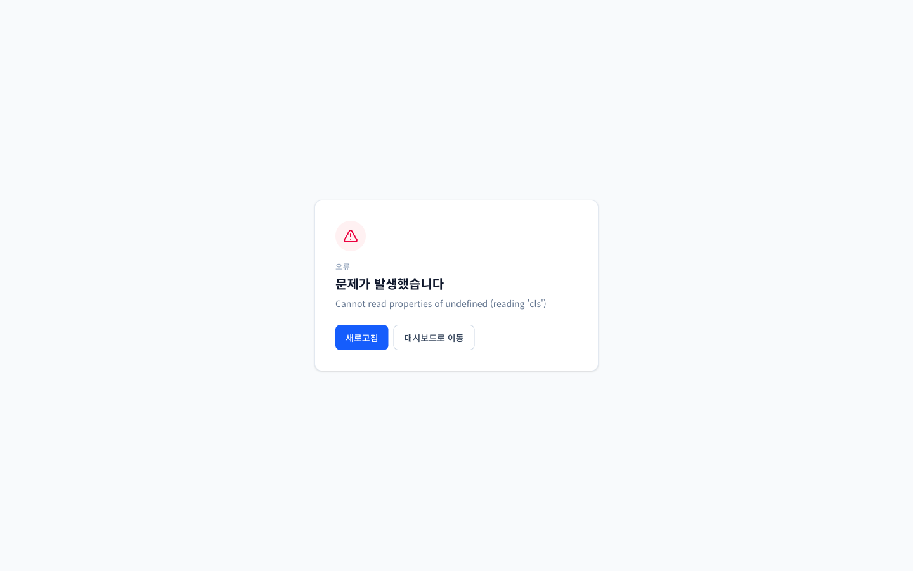
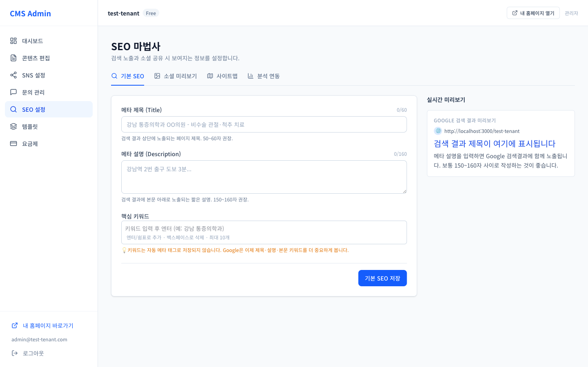
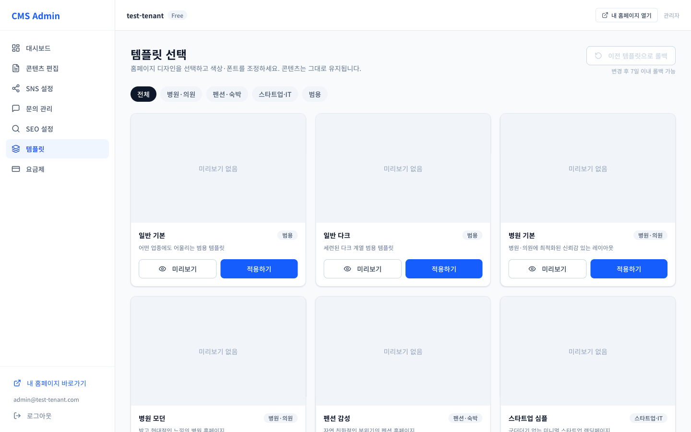
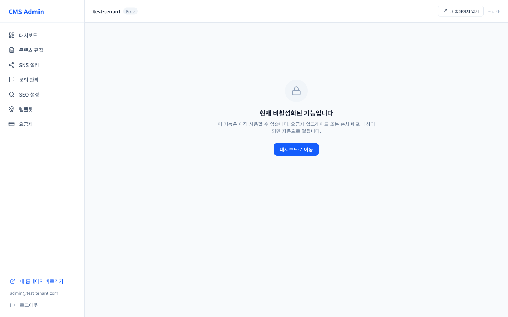
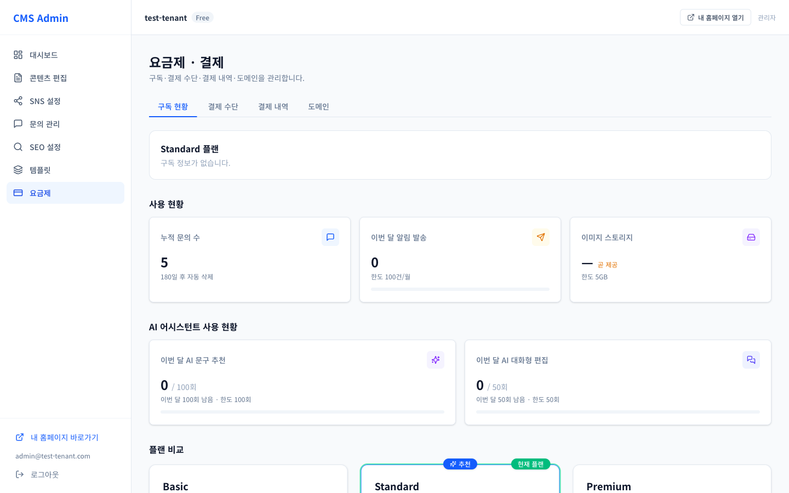

# 테넌트 관리자 사용자 매뉴얼

> **대상:** 사업체(테넌트) 관리자 — 내 홈페이지를 직접 관리하는 고객
> **접속:** `https://admin.{도메인}/login` 또는 내 홈페이지 `https://{도메인}/{내주소}/login`
> **로컬 개발:** `http://localhost:3001`

---

## 1. 로그인 / 로그아웃

1. **관리자 페이지**(`admin.{도메인}`) 또는 **내 홈페이지의 로그인**에서 접속합니다.
   두 곳 모두 **같은 계정**으로 로그인되며, 로그인 상태는 공유됩니다.
2. **이메일 + 비밀번호** 입력 → 로그인
3. 로그인 후 **대시보드**로 이동합니다.
4. 우측 상단(또는 사이드바)에서 **로그아웃**.

> 계정은 운영사가 생성해 전달합니다(이메일 + 초기 비밀번호).

---

## 2. 화면 구성 (사이드바 메뉴)

| 메뉴 | 경로 | 설명 |
|---|---|---|
| **대시보드** | 홈 | 방문자·문의 요약 |
| **콘텐츠 편집** | 섹션 관리 | 홈페이지 내용 편집 |
| **SNS 설정** | 소셜 채널 | 카카오·인스타 등 링크 |
| **문의 관리** | 고객 문의 | 접수·처리 |
| **SEO 설정** | 검색 최적화 | 메타 정보·사이트맵 |
| **템플릿** | 디자인 | 홈페이지 템플릿 선택 |
| **분석** | 방문자 분석 | 방문 통계 |
| **요금제** | 결제 | 플랜·결제 관리 |
| **내 홈페이지 바로가기** | — | 실제 홈페이지 새 탭 열기 |

> ⚠️ 일부 메뉴(콘텐츠 편집·SEO·템플릿·분석 등)는 **요금제/기능 설정에 따라 보이지 않을 수 있습니다.**
> 필요한 기능이 안 보이면 요금제 업그레이드 또는 운영사에 문의하세요.

---

## 3. 대시보드

로그인 후 첫 화면. 우리 홈페이지 현황을 한눈에 봅니다.
- **오늘 방문자** / **이번주 방문자**
- **오늘 신규 문의**
- **미처리 문의** — "응대가 필요해요" 안내

---

## 4. 콘텐츠 편집 (핵심)

홈페이지에 표시되는 **섹션**들을 관리합니다.

### 4-1. 섹션이란?
홈페이지를 구성하는 블록입니다. 유형:
- **메인 배너**(Hero) · **소개**(Intro) · **서비스/진료안내**(Services)
- **갤러리**(사진) · **오시는 길/지도**(Map) · **문의**(Contact)

### 4-2. 편집 방법
1. **콘텐츠 편집** 메뉴 → **섹션 관리** 목록
2. 편집할 섹션 선택 → 폼에서 내용 입력
   - **기본 설정** / **모바일 설정** 탭으로 PC·모바일 각각 조정
   - 이미지 업로드, 제목·문구 입력 (글자 수 제한 표시됨)
3. 저장하면 홈페이지에 **즉시 반영**됩니다.
4. 섹션 **표시/숨기기**, **순서 변경**으로 홈페이지 구성을 바꿀 수 있습니다.

### 4-3. 두 가지 편집 방식 (결과는 동일)
| 방식 | 위치 | 특징 |
|---|---|---|
| **폼 편집** | 관리자 페이지 → 콘텐츠 편집 | 항목별 입력 |
| **인라인 편집** | 내 홈페이지에서 ✏️ **편집 모드** | 화면에서 바로 클릭 수정 |

> 인라인 편집: 로그인 상태로 내 홈페이지 접속 → 우측 하단 **편집 모드** 버튼 → 텍스트/이미지를 화면에서 직접 클릭해 수정 → 저장. 어디서 고치든 결과는 같습니다.

---

## 5. SNS 설정

소셜 채널 링크를 등록하면 홈페이지에 아이콘으로 노출됩니다.
- **카카오톡 채널 · 인스타그램 · 페이스북 · 유튜브 · 네이버 블로그 · 네이버 플레이스**
- **노출 위치** 설정 (개별 위치 선택은 순차 제공 예정)

---

## 6. 문의 관리

홈페이지 방문자가 남긴 **문의**를 확인·처리합니다.
- **목록**: 이름·연락처·내용·상태
- **검색**: 이름·연락처·내용
- **상태 필터**: `전체 상태` / `미확인만`
- **상태 변경**: 미확인 → **확인됨** 으로 처리
- **알림**: 새 문의가 오면 등록된 **이메일** / **카카오 알림톡**으로 알림 발송
  (SNS 설정에서 수신 설정, "이번 달 발송 현황" 확인)

---

## 7. SEO 설정

검색(네이버·구글) 노출을 위한 설정입니다.
- **기본 SEO**: **메타 제목(Title)**, **메타 설명(Description)**
- **소셜 미리보기**: 카톡/페북 공유 시 보이는 이미지·문구 (실시간 미리보기 제공)
- **사이트맵**: 공개 사이트맵 URL 제공(검색엔진 제출용)
- **분석/검증 연동**: **네이버 사이트 검증 코드**, 구글 등 (서치어드바이저 발급 값 입력)
- **검색엔진 사이트 등록 가이드** 제공

---

## 8. 템플릿

홈페이지 **디자인 템플릿**을 선택·변경합니다.
1. **템플릿 선택** 메뉴에서 원하는 템플릿 선택
2. **커스터마이징 미리보기**로 색상·**제목 폰트** 등 조정 후 확인
3. "이 템플릿을 적용할까요?" 확인 → 적용
> ✅ 템플릿을 바꿔도 **입력한 콘텐츠(섹션 내용)는 그대로 유지**됩니다.

---

## 9. 분석

방문자 통계를 봅니다.
- **방문자 분석**: 방문 추이
- **기간 선택**으로 원하는 구간 조회

---

## 10. 요금제 / 결제

구독 플랜과 결제를 관리합니다.
- **플랜 보러가기 / 플랜 업그레이드**: 상위 플랜으로 변경(더 많은 기능/한도)
- **결제 수단 등록**: 카드 등록 후 정기결제
- **무료 체험**: 체험 기간 안내
- **구독 해지**: 해지해도 **현재 결제 기간까지는 계속 이용** 가능
- **구독 만료** 시 안내 페이지 표시

> 플랜에 따라 사용 가능한 기능(콘텐츠 편집·SEO·분석 등)과 한도(이미지 용량, 알림톡 수 등)가 달라집니다.

---

## 11. 자주 하는 작업

| 하고 싶은 것 | 경로 |
|---|---|
| 홈페이지 문구/사진 바꾸기 | 콘텐츠 편집 → 섹션 선택 (또는 홈페이지 인라인 편집) |
| 카카오·인스타 링크 걸기 | SNS 설정 |
| 새 문의 확인·처리 | 문의 관리 → 상태 변경 |
| 네이버/구글 검색 노출 | SEO 설정 → 메타 정보 + 사이트 검증 |
| 홈페이지 디자인 변경 | 템플릿 → 선택 → 적용 |
| 방문자 수 확인 | 대시보드 / 분석 |
| 플랜 변경·카드 등록 | 요금제 |
| 실제 홈페이지 보기 | 사이드바 "내 홈페이지 바로가기" |

---

## 12. 문제 해결

| 증상 | 확인 |
|---|---|
| 메뉴가 안 보임 | 해당 기능이 요금제/설정에 포함됐는지 확인, 필요 시 업그레이드·운영사 문의 |
| 저장이 안 됨 | 네트워크 확인, 글자 수 제한 초과 여부 확인 |
| 편집 모드 버튼이 없음 | 홈페이지에 **로그인 상태**여야 편집 모드 버튼이 나타남 |
| 결제/구독 만료 | 요금제에서 결제 수단 등록 또는 플랜 갱신 |
| "권한 없음(403)" | 다른 사업체 데이터 접근 등 권한 밖 요청 — 정상 차단 |
